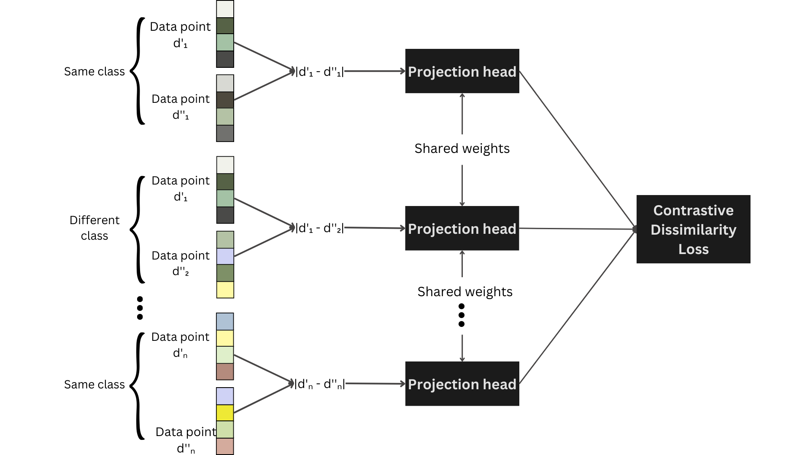

# Contrastive dissimilarity: optimizing performance on imbalanced and limited data sets

A primary challenge in pattern recognition is imbalanced datasets, resulting in skewed and biased predictions. This problem is exacerbated by limited data availability, increasing the reliance on expensive expert data labeling.  The study introduces a novel method called contrastive dissimilarity, which combines dissimilarity-based representation with contrastive learning to improve classification performance in imbalance and data scarcity scenarios. Based on pairwise sample differences, dissimilarity representation excels in situations with numerous overlapping classes and limited samples per class. Unlike traditional methods that use fixed distance functions like Euclidean or cosine, our proposal employs metric learning with contrastive loss to estimate a custom dissimilarity function. We conducted extensive evaluations in 13 databases across multiple training-test splits. The results showed that this approach outperforms traditional models like SVM, Random Forest, and Naive Bayes, particularly in settings with limited training data.

## Methods

The method involves siamese network training and dissimilarity representation. During training, tabular data rows are paired within the same class, and their differences are fed into a projection head to generate dissimilarity values for contrastive loss calculation. The dissimilarity representation phase uses the projection head to estimate dissimilarity values by comparing each data observation against prototype samples, forming the training and testing sets.



## Datasets

We employed 11 databases from Keel repository and 2 databases from UC Irvine Machine Learning Repository. We focused primarily on datasets with an imbalance ratio higher than five, meaning that the majority class is five times more frequent than the minority class, the only exceptions being Hayes-roth and Glass1.

| No. | Source | Database                            | Instances | Features | Classes | IR    |
|----:|--------|-------------------------------------|-----------|----------|---------|-------|
| 01  | Keel   | HayesRoth                           | 132       | 4        | 3       | 1.70  |
| 02  | Keel   | Glass1                              | 214       | 9        | 2       | 1.82  |
| 03  | Keel   | NewThyroid                          | 215       | 5        | 3       | 5.00  |
| 04  | Keel   | Dermatology                         | 366       | 34       | 6       | 5.60  |
| 05  | Keel   | Balance                             | 625       | 4        | 3       | 5.88  |
| 06  | Keel   | Segment0                            | 2,308     | 19       | 2       | 6.02  |
| 07  | UCI    | DryBean                             | 13,611    | 16       | 7       | 6.79  |
| 08  | Keel   | Glass                               | 214       | 9        | 6       | 8.44  |
| 09  | Keel   | PageBlocks0                         | 5,472     | 10       | 2       | 8.79  |
| 10  | Keel   | Vowel0                              | 988       | 13       | 2       | 9.98  |
| 11  | Keel   | Yeast4                              | 1,484     | 8        | 2       | 28.10 |
| 12  | UCI    | HCV                                 | 615       | 12       | 5       | 76.14 |
| 13  | Keel   | Yeast                               | 1,484     | 8        | 10      | 92.60 |

## Results

In this analysis, we conduct an extensive assessment contrasting our innovative contrastive dissimilarity approach with established machine learning techniques, particularly focusing on their F1-score metrics. The table below present our main findings, encompassing the results from our proposed contrastive dissimilarity space (CS) and vector (CV), traditional models (the best of RF, SVM, or NB, abbreviated as Tradt), as well as classic dissimilarity space and vector (DS and DV, respectively).

| Database     | Method          | 10%  | 20%  | 30%  | 40%  | 50%  | 60%  | 70%  | 80%  | 90%  | 100%  |
|--------------|-----------------|------|------|------|------|------|------|------|------|------|-------|
| Hayes-roth   | CS              | 0.74 | 0.76 | 0.73 | 0.76 | 0.76 | 0.76 | 0.72 | 0.78 | 0.78 | 0.74  |
|              | CS wt/ SMOTE    | 0.46 | 0.6  | 0.7  | 0.63 | 0.64 | 0.69 | 0.69 | 0.71 | 0.69 | 0.63  |
|              | CV              | 0.78 | 0.8  | 0.8  | 0.78 | 0.79 | 0.75 | 0.75 | 0.76 | 0.81 | 0.79  |
|              | CV wt/ SMOTE    | 0.48 | 0.6  | 0.65 | 0.63 | 0.65 | 0.72 | 0.74 | 0.76 | 0.65 | 0.77  |
|              | Tradt           | 0.51 | 0.57 | 0.57 | 0.58 | 0.72 | 0.74 | 0.78 | 0.78 | 0.82 | 0.8   |
|              | Tradt wt/ SMOTE | 0.49 | 0.59 | 0.6  | 0.58 | 0.7  | 0.75 | 0.75 | 0.78 | 0.77 | 0.79  |
|              | DS              | 0.54 | 0.69 | 0.72 | 0.72 | 0.75 | 0.72 | 0.81 | 0.77 | 0.77 | 0.8   |
|              | DV              | 0.42 | 0.56 | 0.69 | 0.64 | 0.57 | 0.7  | 0.64 | 0.76 | 0.67 | 0.73  |
| Glass1       | CS              | 0.64 | 0.89 | 0.87 | 0.9  | 0.82 | 0.79 | 0.69 | 0.8  | 0.81 | 0.84  |
|              | CS wt/ SMOTE    | 0.6  | 0.66 | 0.77 | 0.78 | 0.78 | 0.81 | 0.79 | 0.77 | 0.81 | 0.79  |
|              | CV              | 0.6  | 0.71 | 0.84 | 0.77 | 0.8  | 0.8  | 0.71 | 0.82 | 0.84 | 0.78  |
|              | CV wt/ SMOTE    | 0.57 | 0.66 | 0.77 | 0.8  | 0.83 | 0.82 | 0.84 | 0.81 | 0.84 | 0.79  |
|              | Tradt           | 0.56 | 0.68 | 0.78 | 0.76 | 0.79 | 0.77 | 0.81 | 0.81 | 0.82 | 0.82  |
|              | Tradt wt/ SMOTE | 0.59 | 0.71 | 0.82 | 0.77 | 0.77 | 0.79 | 0.75 | 0.86 | 0.84 | 0.84  |
|              | DS              | 0.39 | 0.39 | 0.8  | 0.74 | 0.79 | 0.68 | 0.77 | 0.8  | 0.75 | 0.77  |
|              | DV              | 0.5  | 0.7  | 0.7  | 0.68 | 0.8  | 0.78 | 0.75 | 0.79 | 0.77 | 0.74  |
| New-Thyroid  | CS              | 1.0  | 0.98 | 1.0  | 1.0  | 1.0  | 0.98 | 0.98 | 0.96 | 0.96 | 0.96  |
|              | CS wt/ SMOTE    | 0.88 | 0.78 | 0.97 | 1.0  | 0.98 | 0.98 | 0.98 | 0.98 | 0.98 | 1.0   |
|              | CV              | 1.0  | 0.98 | 0.98 | 0.98 | 1.0  | 1.0  | 1.0  | 1.0  | 1.0  | 1.0   |
|              | CV wt/ SMOTE    | 0.88 | 0.98 | 0.97 | 0.98 | 0.98 | 0.96 | 0.98 | 0.98 | 0.98 | 0.98  |
|              | Tradt           | 0.96 | 1.0  | 0.96 | 0.98 | 0.98 | 0.98 | 0.98 | 0.98 | 0.98 | 0.98  |
|              | Tradt wt/ SMOTE | 0.95 | 0.96 | 0.98 | 1.0  | 0.98 | 0.96 | 0.96 | 0.96 | 0.96 | 0.98  |
|              | DS              | 0.96 | 0.85 | 0.96 | 0.98 | 0.98 | 0.96 | 0.98 | 0.98 | 0.98 | 1.0   |
|              | DV              | 0.81 | 0.79 | 0.85 | 0.85 | 0.96 | 0.94 | 0.96 | 0.94 | 0.96 | 0.96  |
| Dermatology  | CS              | 0.97 | 1.0  | 0.98 | 0.98 | 0.96 | 1.0  | 1.0  | 1.0  | 1.0  | 0.99  |
|              | CS wt/ SMOTE    | 0.82 | 0.86 | 0.89 | 0.92 | 0.88 | 0.96 | 0.94 | 0.97 | 0.95 | 0.96  |
|              | CV              | 1.0  | 1.0  | 1.0  | 1.0  | 0.99 | 0.99 | 0.99 | 0.99 | 0.99 | 0.99  |
|              | CV wt/ SMOTE    | 0.86 | 0.91 | 0.97 | 0.97 | 0.98 | 0.96 | 0.96 | 0.97 | 0.97 | 0.97  |
|              | Tradt           | 0.97 | 0.95 | 0.97 | 0.98 | 0.97 | 0.96 | 0.96 | 0.98 | 1.0  | 0.97  |
|              | Tradt wt/ SMOTE | 0.95 | 0.97 | 0.97 | 0.98 | 0.98 | 0.97 | 0.99 | 0.99 | 0.98 | 0.98  |
|              | DS              | 0.91 | 0.88 | 0.91 | 0.93 | 0.92 | 0.92 | 0.94 | 0.92 | 0.93 | 0.95  |
|              | DV              | 0.94 | 0.96 | 0.96 | 0.96 | 0.98 | 0.95 | 0.94 | 0.98 | 0.95 | 0.98  |
| Balance      | CS              | 0.84 | 0.83 | 0.85 | 0.87 | 0.9  | 0.89 | 0.92 | 0.91 | 0.93 | 0.92  |
|              | CS wt/ SMOTE    | 0.66 | 0.6  | 0.77 | 0.86 | 0.88 | 0.89 | 0.9  | 0.91 | 0.86 | 0.87  |
|              | CV              | 0.78 | 0.75 | 0.74 | 0.72 | 0.71 | 0.76 | 0.72 | 0.8  | 0.73 | 0.77  |
|              | CV wt/ SMOTE    | 0.69 | 0.72 | 0.7  | 0.7  | 0.72 | 0.71 | 0.67 | 0.79 | 0.7  | 0.77  |
|              | Tradt           | 0.81 | 0.77 | 0.8  | 0.86 | 0.87 | 0.85 | 0.91 | 0.93 | 0.9  | 0.95  |
|              | Tradt wt/ SMOTE | 0.8  | 0.77 | 0.88 | 0.93 | 0.94 | 0.9  | 0.88 | 0.89 | 0.95 | 0.92  |
|              | DS              | 0.68 | 0.73 | 0.83 | 0.84 | 0.9  | 0.86 | 0.88 | 0.92 | 0.92 | 0.93  |
|              | DV              | 0.38 | 0.46 | 0.48 | 0.55 | 0.62 | 0.62 | 0.61 | 0.78 | 0.69 | 0.69  |
| Segment0     | CS              | 0.99 | 0.99 | 0.99 | 0.99 | 0.99 | 1.0  | 1.0  | 1.0  | 1.0  | 1.0   |
|              | CS wt/ SMOTE    | 0.99 | 0.99 | 0.99 | 0.99 | 1.0  | 1.0  | 1.0  | 1.0  | 1.0  | 1.0   |
|              | CV              | 0.95 | 0.99 | 0.99 | 0.99 | 0.99 | 0.99 | 0.99 | 0.99 | 1.0  | 0.99  |
|              | CV wt/ SMOTE    | 0.95 | 0.99 | 0.99 | 0.99 | 0.99 | 0.99 | 0.99 | 0.99 | 0.99 | 0.99  |
|              | Tradt           | 0.98 | 0.99 | 0.99 | 0.99 | 0.99 | 1.0  | 0.99 | 1.0  | 1.0  | 1.0   |
|              | Tradt wt/ SMOTE | 0.99 | 0.98 | 0.99 | 0.99 | 0.99 | 0.99 | 0.99 | 0.99 | 0.99 | 0.99  |
|              | DS              | 0.92 | 0.97 | 0.98 | 0.99 | 0.99 | 0.99 | 0.98 | 1.0  | 0.99 | 0.99  |
|              | DV              | 0.97 | 0.99 | 0.99 | 0.99 | 0.99 | 0.99 | 0.99 | 0.99 | 0.99 | 0.99  |
| DryBean      | CS              | 0.94 | 0.94 | 0.94 | 0.94 | 0.94 | 0.94 | 0.94 | 0.94 | 0.94 | 0.94  |
|              | CS wt/ SMOTE    | 0.94 | 0.94 | 0.94 | 0.94 | 0.94 | 0.94 | 0.94 | 0.94 | 0.94 | 0.94  |
|              | CV              | 0.92 | 0.92 | 0.92 | 0.92 | 0.92 | 0.93 | 0.93 | 0.93 | 0.93 | 0.93  |
|              | CV wt/ SMOTE    | 0.92 | 0.91 | 0.92 | 0.92 | 0.92 | 0.92 | 0.92 | 0.92 | 0.92 | 0.92  |
|              | Tradt           | 0.92 | 0.93 | 0.93 | 0.93 | 0.93 | 0.93 | 0.94 | 0.93 | 0.93 | 0.94  |
|              | Tradt wt/ SMOTE | 0.93 | 0.93 | 0.94 | 0.94 | 0.94 | 0.94 | 0.94 | 0.94 | 0.94 | 0.94  |
|              | DS              | 0.93 | 0.93 | 0.94 | 0.94 | 0.94 | 0.94 | 0.94 | 0.94 | 0.94 | 0.94  |
|              | DV              | 0.92 | 0.92 | 0.92 | 0.93 | 0.93 | 0.93 | 0.93 | 0.93 | 0.93 | 0.93  |
| Glass        | CS              | 0.45 | 0.5  | 0.68 | 0.68 | 0.66 | 0.65 | 0.65 | 0.67 | 0.63 | 0.68  |
|              | CS wt/ SMOTE    | 0.34 | 0.37 | 0.57 | 0.53 | 0.59 | 0.58 | 0.6  | 0.61 | 0.58 | 0.63  |
|              | CV              | 0.58 | 0.6  | 0.76 | 0.66 | 0.7  | 0.67 | 0.63 | 0.63 | 0.66 | 0.73  |
|              | CV wt/ SMOTE    | 0.35 | 0.47 | 0.56 | 0.58 | 0.56 | 0.61 | 0.66 | 0.71 | 0.63 | 0.67  |
|              | Tradt           | 0.41 | 0.41 | 0.59 | 0.57 | 0.48 | 0.66 | 0.65 | 0.64 | 0.66 | 0.68  |
|              | Tradt wt/ SMOTE | 0.41 | 0.4  | 0.49 | 0.54 | 0.56 | 0.6  | 0.6  | 0.65 | 0.66 | 0.73  |
|              | DS              | 0.29 | 0.31 | 0.51 | 0.48 | 0.51 | 0.61 | 0.63 | 0.65 | 0.74 | 0.65  |
|              | DV              | 0.3  | 0.37 | 0.51 | 0.44 | 0.51 | 0.63 | 0.68 | 0.6  | 0.63 | 0.61  |
| Page-Blocks0 | CS              | 0.9  | 0.91 | 0.93 | 0.94 | 0.94 | 0.92 | 0.9  | 0.92 | 0.93 | 0.93  |
|              | CS wt/ SMOTE    | 0.84 | 0.86 | 0.88 | 0.9  | 0.89 | 0.92 | 0.91 | 0.92 | 0.91 | 0.9   |
|              | CV              | 0.89 | 0.88 | 0.91 | 0.92 | 0.9  | 0.89 | 0.89 | 0.89 | 0.9  | 0.89  |
|              | CV wt/ SMOTE    | 0.82 | 0.82 | 0.84 | 0.86 | 0.84 | 0.83 | 0.84 | 0.81 | 0.84 | 0.83  |
|              | Tradt           | 0.86 | 0.9  | 0.91 | 0.92 | 0.92 | 0.93 | 0.93 | 0.92 | 0.93 | 0.93  |
|              | Tradt wt/ SMOTE | 0.88 | 0.91 | 0.91 | 0.92 | 0.93 | 0.92 | 0.93 | 0.93 | 0.93 | 0.93  |
|              | DS              | 0.85 | 0.86 | 0.86 | 0.9  | 0.91 | 0.9  | 0.92 | 0.91 | 0.91 | 0.92  |
|              | DV              | 0.86 | 0.88 | 0.91 | 0.93 | 0.93 | 0.93 | 0.92 | 0.93 | 0.94 | 0.94  |
| Vowel0       | CS              | 0.85 | 0.85 | 0.91 | 0.96 | 1.0  | 1.0  | 1.0  | 1.0  | 1.0  | 1.0   |
|              | CS wt/ SMOTE    | 0.83 | 0.88 | 0.87 | 0.92 | 1.0  | 0.99 | 1.0  | 1.0  | 1.0  | 1.0   |
|              | CV              | 0.83 | 0.87 | 0.89 | 0.9  | 0.93 | 0.94 | 0.93 | 0.98 | 0.97 | 0.95  |
|              | CV wt/ SMOTE    | 0.76 | 0.83 | 0.85 | 0.86 | 0.92 | 0.91 | 0.91 | 0.93 | 0.93 | 0.93  |
|              | Tradt           | 0.83 | 0.85 | 0.87 | 0.94 | 0.97 | 1.0  | 1.0  | 1.0  | 0.98 | 1.0   |
|              | Tradt wt/ SMOTE | 0.79 | 0.85 | 0.86 | 0.88 | 0.96 | 0.98 | 0.98 | 1.0  | 1.0  | 1.0   |
|              | DS              | 0.82 | 0.85 | 0.85 | 0.87 | 1.0  | 1.0  | 1.0  | 1.0  | 0.99 | 1.0   |
|              | DV              | 0.78 | 0.79 | 0.86 | 0.87 | 0.94 | 0.94 | 0.94 | 1.0  | 1.0  | 1.0   |
| Yeast4       | CS              | 0.49 | 0.68 | 0.77 | 0.75 | 0.65 | 0.67 | 0.74 | 0.7  | 0.74 | 0.72  |
|              | CS wt/ SMOTE    | 0.49 | 0.55 | 0.6  | 0.6  | 0.55 | 0.55 | 0.55 | 0.55 | 0.65 | 0.69  |
|              | CV              | 0.6  | 0.61 | 0.62 | 0.61 | 0.6  | 0.6  | 0.61 | 0.59 | 0.6  | 0.61  |
|              | CV wt/ SMOTE    | 0.6  | 0.59 | 0.65 | 0.58 | 0.59 | 0.57 | 0.59 | 0.57 | 0.57 | 0.6   |
|              | Tradt           | 0.57 | 0.59 | 0.75 | 0.66 | 0.72 | 0.63 | 0.7  | 0.69 | 0.65 | 0.66  |
|              | Tradt wt/ SMOTE | 0.62 | 0.58 | 0.75 | 0.61 | 0.65 | 0.6  | 0.65 | 0.65 | 0.69 | 0.69  |
|              | DS              | 0.49 | 0.55 | 0.66 | 0.59 | 0.59 | 0.6  | 0.57 | 0.65 | 0.63 | 0.62  |
|              | DV              | 0.48 | 0.49 | 0.83 | 0.57 | 0.55 | 0.55 | 0.59 | 0.63 | 0.59 | 0.53  |
| HCV          | CS              | 0.49 | 0.65 | 0.76 | 0.49 | 0.83 | 0.69 | 0.69 | 0.79 | 0.83 | 0.78  |
|              | CS wt/ SMOTE    | 0.28 | 0.45 | 0.4  | 0.46 | 0.7  | 0.51 | 0.58 | 0.61 | 0.73 | 0.54  |
|              | CV              | 0.52 | 0.61 | 0.5  | 0.58 | 0.69 | 0.62 | 0.69 | 0.76 | 0.83 | 0.84  |
|              | CV wt/ SMOTE    | 0.42 | 0.5  | 0.46 | 0.48 | 0.64 | 0.5  | 0.6  | 0.69 | 0.75 | 0.74  |
|              | Tradt           | 0.43 | 0.45 | 0.54 | 0.55 | 0.5  | 0.59 | 0.66 | 0.75 | 0.68 | 0.68  |
|              | Tradt wt/ SMOTE | 0.39 | 0.47 | 0.49 | 0.54 | 0.56 | 0.57 | 0.72 | 0.71 | 0.72 | 0.72  |
|              | DS              | 0.19 | 0.3  | 0.45 | 0.38 | 0.51 | 0.48 | 0.63 | 0.61 | 0.65 | 0.64  |
|              | DV              | 0.44 | 0.37 | 0.26 | 0.42 | 0.39 | 0.57 | 0.47 | 0.43 | 0.51 | 0.4   |
| Yeast        | CS              | -    | 0.58 | 0.6  | 0.6  | 0.61 | 0.61 | 0.6  | 0.57 | 0.59 | 0.58  |
|              | CS wt/ SMOTE    | -    | 0.56 | 0.54 | 0.55 | 0.56 | 0.52 | 0.51 | 0.52 | 0.56 | 0.58  |
|              | CV              | -    | 0.37 | 0.46 | 0.49 | 0.46 | 0.44 | 0.48 | 0.42 | 0.4  | 0.44  |
|              | CV wt/ SMOTE    | -    | 0.35 | 0.4  | 0.34 | 0.33 | 0.37 | 0.39 | 0.37 | 0.35 | 0.38  |
|              | Tradt           | -    | 0.56 | 0.59 | 0.6  | 0.61 | 0.61 | 0.59 | 0.58 | 0.61 | 0.56  |
|              | Tradt wt/ SMOTE | -    | 0.58 | 0.57 | 0.62 | 0.62 | 0.61 | 0.58 | 0.57 | 0.59 | 0.57  |
|              | DS              | -    | 0.5  | 0.54 | 0.5  | 0.58 | 0.58 | 0.58 | 0.57 | 0.6  | 0.55  |
|              | DV              | -    | 0.42 | 0.43 | 0.42 | 0.46 | 0.49 | 0.5  | 0.49 | 0.47 | 0.5   |

## Conclusion

This study introduced a novel method called contrastive dissimilarity, which enhances the classification of imbalanced tabular datasets by combining metric learning with a task-specific dissimilarity function. The approach demonstrated superior performance, particularly in data-scarce scenarios, consistently outperforming traditional machine learning models.

## Citation

```
@Article{Teixeira2024,
  author={Teixeira, Lucas O.
  and Bertolini, Diego
  and Oliveira, Luiz S.
  and Cavalcanti, George D. C.
  and Costa, Yandre M. G.},
  title={Contrastive dissimilarity: optimizing performance on imbalanced and limited data sets},
  journal={Neural Computing and Applications},
  year={2024},
  month={Aug},
  day={12},
  issn={1433-3058},
  doi={10.1007/s00521-024-10286-z},
  url={https://doi.org/10.1007/s00521-024-10286-z}
}
```
